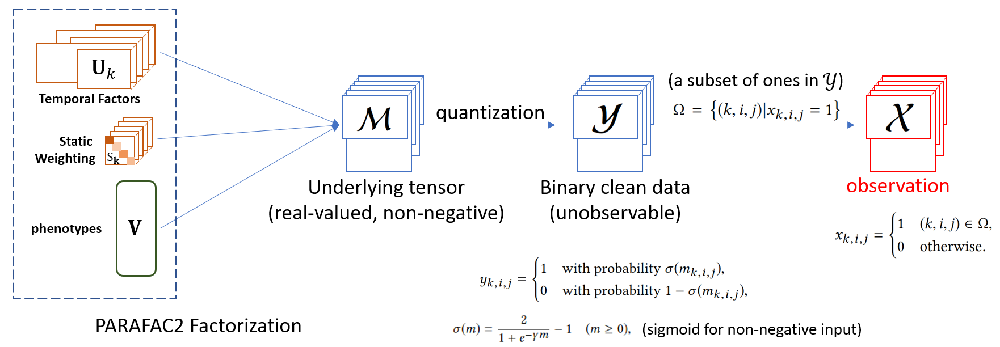

# LogPar: Logistic PARAFAC2 Factorization for Temporal Binary Data with Missing Values (KDD '20)

This repo contains the PyTorch implementation of the paper `LogPar: Logistic PARAFAC2 Factorization for Temporal Binary Data with Missing Values` in KDD 2020. [[paper]](https://dl.acm.org/doi/10.1145/3394486.3403213) [[poster presentation]](https://www.youtube.com/watch?v=X5Q4Ix0a7bs)


<p align="center"></p>  

**Overview**: LogPar assumes that the binary observations are generated from an underlying real-valued irregular tensor via a quantization process followed by random sampling. LogPar factorizes the underlying irregular tensors, instead of the binary observations, using the PARAFAC2 model.


## Citation
If you find the paper or the implementation helpful, please cite the following paper:
```bib
@inproceedings{yin2020logpar,
    author = {Yin, Kejing and Afshar, Ardavan and Ho, Joyce C. and Cheung, William K. and Zhang, Chao and Sun, Jimeng},
    title = {LogPar: Logistic PARAFAC2 Factorization for Temporal Binary Data with Missing Values},
    year = {2020},
    publisher = {Association for Computing Machinery},
    address = {New York, NY, USA},
    doi = {10.1145/3394486.3403213},
    booktitle = {Proceedings of the 26th ACM SIGKDD International Conference on Knowledge Discovery \& Data Mining},
    pages = {1625–1635},
    location = {Virtual Event, CA, USA},
    series = {KDD '20}
}
```


## Requirements
The codes have been tested with the following packages:
- Python 3.7
- PyTorch 1.3

## Quick Demo
To run the model with a quick demo data, simply clone the repo and decompress the data archive by executing the following commands:
```bash
git clone git@github.com:jakeykj/LogPar.git
cd LogPar
tar -xzvf demo_data.tar.gz
python main.py
```
A folder `./results/` will be automatically created and the results will be saved there.

Use `python main.py --help` to obtain more information about setting the parameters of the model.

## Data Format and Organization
The data are organized in a Python List object and is saved using the Python built-in `pickle` module. Each element in the list corresponds to a patient (one slice of the binary irregular tensor), and is a dictionary object, with the following elements:
- **`pid`**: The unique identifier of the patient.
- **`train`**: The subset for training containing only positive observations. It is a N-by-3 matrix-like "list of list" object. each "row" represents a positive entry in the slice of the irregular tensor corresponding to this patient. The first column is the visit id starting from zero, the second column is the feature id starting from zero, and the third column is the value at that entry. Note that during training phase, all entries except the observed positive ones are regarded as zero, so it is not neccessary to specify the zero entries in the `train` subset.
- **`validation`**: The subset for validation. It follows the same structure as the `train` subset, with the only difference that some negative entries are required for evaluation.
- **`test`**: The subset for test. It has the same sturcture as the `validation` subset.
- **`times`**: A Python List object containing the time stamps of the hospital visits of the patient.
- **`deltas`**: A Python List object containing the time gaps between hospital visits (in days).
- **`label`**: The label of the predictive task for the patient. If no label information is available, set it to `None`.


If you use other datasets, you can organize the input data in the same format described above, and pass the `<DATA_PATH>` as a parameter to the training script:
```bash
python main.py --data_path <DATA_PATH>
```


## Contact
If you have any enquires, please contact Mr. Kejing Yin by email: 
`cskjyin [AT] comp [DOT] hkbu.edu.hk`.

---
:point_right: Check out [my home page](https://kejing.me) for more research work by us.
